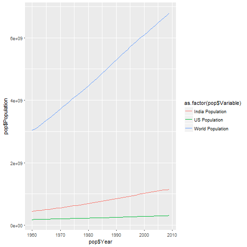

Course Project: Shiny Application and Reproducible Pitch
========================================================
author: Pradeep Peddineni
date: 02/16/2017


Overview
========================================================

This application was built as part of a deliverable for the course **Developing Data Products** which indeed a course in Coursera Data Science Specialization.

The app developed for the first part of the assignment demo is avalilable at:
https://laughing-lamp.shinyapps.io/population/

Source code for ui.R and server.R files are available on the GitHub repo:
https://github.com/pradeeppeddineni/Shiny-Application-and-Reproducible-Pitch/


Web Application functionality
========================================================

<small>
This application allows users to discover the population growth trend between places.The main challenge while building this app was to manually collect and cleanse the data from sources.

The respective numbers of inhabitants of the places can be selected using the radio buttons. Moreover, a desired data period can be specified by using the date slider. 

You are able to check every data point of the plot by hovering over the line chart with your mouse. Further, you can check the raw data by clicking in the tab with the same name
</small> 


Population Dataset
========================================================

The data used in the app comes from three different datasets which has been later merged in to one. Let us have a look on the Population data set.


```
# A tibble: 6 × 3
   Year Population      Variable
  <int>      <dbl>         <chr>
1  1960  180671000 US Population
2  1961  183691000 US Population
3  1962  186538000 US Population
4  1963  189242000 US Population
5  1964  191889000 US Population
6  1965  194303000 US Population
```

```
[1] 150   3
```


Plot
========================================================

The relationship between population data between locations all plotted below..




Installation Manual
========================================================

<small>The application can be accessed online on [RStudio's Shinyapp Server](https://laughing-lamp.shinyapps.io/population/) (recommended) or it can be downloaded from github and run on the user's computer.

Download the Source code of app from [Github](https://github.com/pradeeppeddineni/Shiny-Application-and-Reproducible-Pitch/).

#### Files to download
```
1. server.R
2. ui.R
3. data.csv
```
#### Running the App
Create a new directory and place the three files there. Open all files in your R IDE and enter the following lines on your R console.

```
library(shiny) 
runApp()
```
</small>


Sources:
========================================================
<small>
# http://www.tradingeconomics.com/india/population
# https://www.census.gov/support/USACdataDownloads.html
</small>
